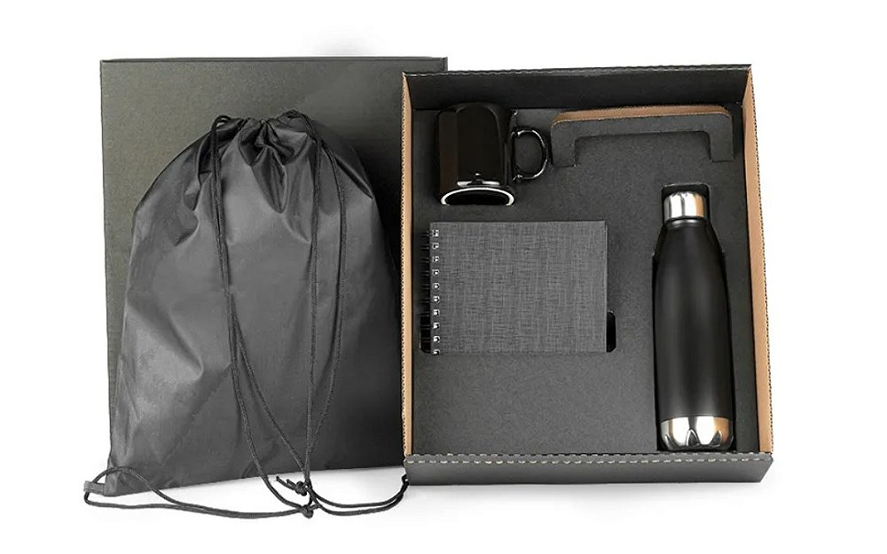

# SeuBoné Personalizados - Landing Page



## Sobre o Projeto

Landing page responsiva desenvolvida para a empresa fictícia "SeuBoné Personalizados", especializada em brindes corporativos personalizados. O objetivo da página é gerar leads B2B, apresentando os produtos e serviços da empresa de forma atrativa e profissional.

### Público-Alvo

- Gerentes e Analistas de Marketing
- Profissionais de RH
- Organizadores de Eventos
- Empresários e Diretores

## Tecnologias Utilizadas

- **HTML5** - Estrutura semântica
- **CSS3** - Estilos responsivos e animações
- **JavaScript** - Interatividade e validação de formulários
- **Font Awesome** - Ícones
- **Google Fonts** - Tipografia (Montserrat e Open Sans)

## Design

### Paleta de Cores
- **Azul Escuro:** #2c3e50 (Cor primária)
- **Verde:** #2ecc71 (Cor de destaque/CTA)
- **Azul Claro:** #3498db (Links e elementos secundários)
- **Cinza Claro:** #f4f4f4 (Fundo de seções alternadas)

### Tipografia
- **Títulos:** Montserrat (700, 600)
- **Corpo de texto:** Open Sans (400, 600)

## Responsividade

A landing page é totalmente responsiva e se adapta a diferentes tamanhos de tela:
- **Desktop:** Layout completo
- **Tablet:** Ajustes de grid e tamanho de elementos (max-width: 992px)
- **Mobile:** Menu hamburguer, layouts empilhados (max-width: 768px)
- **Mobile pequeno:** Ajustes adicionais de tamanho (max-width: 576px)

## Estrutura do Projeto

```
seubone_landing_page/
│
├── index.html          # Estrutura HTML da landing page
├── styles.css          # Estilos CSS
├── script.js           # Funcionalidades JavaScript
├── images/             # Pasta de imagens
│   ├── bones_brindes.jpg
│   ├── bones_eventos.jpg
│   ├── kit_escritorio.webp
│   ├── kit_executivo.jpg
│   ├── kit_executivo2.jpg
│   └── kit_queijo.jpg
└── README.md           # Documentação do projeto
```

## Seções da Landing Page

1. **Header** - Navegação fixa com logo e menu
2. **Hero Section** - Título principal, subtítulo e CTA
3. **Sobre** - Informações sobre a empresa
4. **Produtos** - Grid de produtos oferecidos
5. **Benefícios** - Vantagens dos produtos
6. **Público-Alvo** - Para quem são os produtos
7. **Processo** - Como funciona o processo de compra
8. **Depoimentos** - Feedback de clientes
9. **Contato** - Formulário e informações de contato
10. **Footer** - Links, newsletter e copyright

## Funcionalidades

- **Menu Responsivo** - Menu hamburguer em telas menores
- **Rolagem Suave** - Navegação suave entre as seções
- **Animações** - Elementos aparecem com fade-in ao rolar a página
- **Botão "Voltar ao Topo"** - Aparece após rolagem
- **Formulários** - Validação de formulário de contato e newsletter
- **Efeitos Hover** - Em botões, cards e links

## Como Usar

1. Clone este repositório:
```bash
git clone https://github.com/seu-usuario/seubone-landing-page.git
```

2. Navegue até a pasta do projeto:
```bash
cd seubone-landing-page
```

3. Abra o arquivo `index.html` em seu navegador ou utilize um servidor local.

## Personalização

### Para alterar as imagens:
1. Substitua os arquivos na pasta `images/` mantendo os mesmos nomes ou atualize os caminhos no HTML.

### Para alterar as cores:
1. Edite as variáveis CSS no início do arquivo `styles.css`:
```css
:root {
    --primary-color: #2c3e50;
    --accent-color: #2ecc71;
    --secondary-color: #3498db;
    /* outras cores... */
}
```

### Para alterar o conteúdo:
1. Edite o texto diretamente no arquivo `index.html`.

## Otimização para SEO

- Meta tags descritivas
- Estrutura semântica HTML5
- Imagens com atributos alt
- Hierarquia de títulos adequada (H1, H2, H3)

## Compatibilidade

- Chrome
- Firefox
- Safari
- Edge
- Opera

## Licença

Este projeto está sob a licença MIT. Veja o arquivo [LICENSE](LICENSE) para mais detalhes.

## Autor

Desenvolvido por [Beatriz Araujo](https://github.com/beatrizaraujow/)

---
